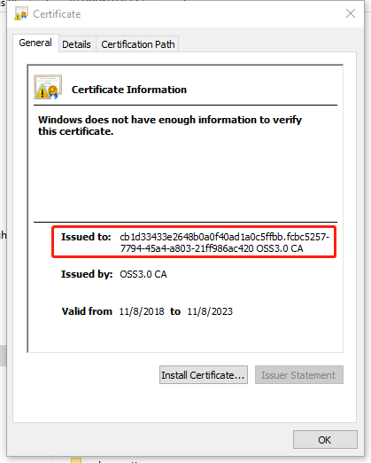

# MQTT SDK
# 快速使用

1.在https://console.huaweicloud.com/ief2.0 页面下载创建的直连设备的证书：包括ca.ct，private_cert.crt和private_cert.key。

2.在include/atiny_config.h分别配置MQTT_TEST_CA_CRT，MQTT_TEST_CLI_CRT和MQTT_TEST_CLI_KEY。

3.在include/atiny_config.h中配置AGENT_TINY_PROJECT_ID和AGENT_TINY_DEVICE_ID。这两项配置可以查看private_cert.crt中：

其中：“.”之前的字串为AGENT_TINY_PROJECT_ID，"."之后的字串为AGENT_TINY_DEVICE_ID。

4.make之后执行build/Atiny.elf。

## 注：

1.对于publish来的message的处理都在各个*_message_cb函数中，请自行添加具体的处理，默认打印message。

2.lwip的支持。lwip的socket api和当前使用的linux socket保持一致，可以快速移植到MCU的lwip上执行。